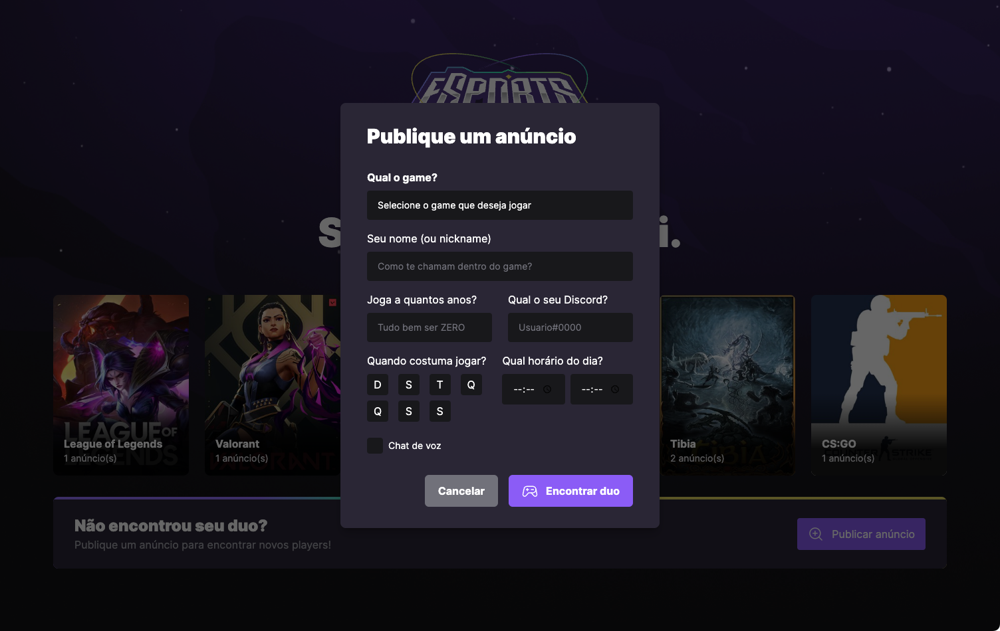
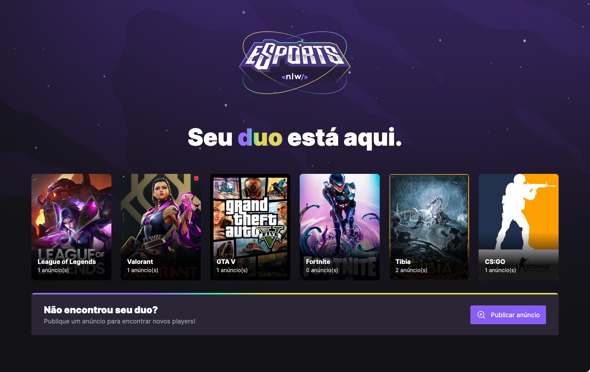
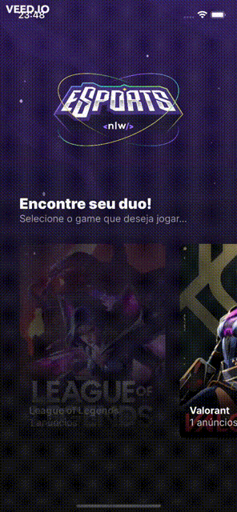

## 💻 Sobre o projeto

Esse projeto foi proposto pela Rocketseat durante a semana NLW eSports - Trilha Ignite. O objetivo do projeto era desenvolver uma aplicação nas versões web e mobile (junto com o back end) utilizando o React e o React Native.

A aplicação permite a visualização e publicação de anúncios para encontrar parceiros de jogos online.

Para encontrar duo para jogar você precisa realizar um preenchimento: 
* Qual jogo deseja encontrar um duo;
* Qua o nickname do jogador;
* Há quanto tempo joga esse jogo;
* Em quais dias e horários ele constuma estar online;
* Se costuma se conectar por voz;
* Nome do usuário no Discord;

<br>

Criação de anúncios na versão web:
<div>
    
</div>

<br>

Visualização na versão web:

<div>
    
</div>

<br>

Visualização na versão mobile:
<div>
    
</div>

---

## 🚀 Tecnologias usadas

Esse projeto foi desenvolvido com as seguintes tecnologias:

- [Javascript](https://developer.mozilla.org/pt-BR/docs/Web/JavaScript)
- [Typescript](https://www.typescriptlang.org/)
- [Node.js](https://nodejs.org/en/)
- [ReactJs](https://reactjs.org)
- [ReactNative](https://reactnative.dev)
- [Tailwindcss](https://tailwindcss.com/)
- [Radix UI](https://www.radix-ui.com/)
- [Phosphoricons](https://phosphoricons.com/)
- [Prisma ORM](https://www.prisma.io//)
- [Vite](https://vitejs.dev/)
- [Expo](https://expo.dev/)

---

## 📁 Como baixar o projeto:
</br>

### 💻 Back End (servidor)
```bash
# Clonando o repositório
$ git clone https://github.com/steephanie/nlw-eSports-ignite
# Acesse a pasta do projeto no terminal
$ cd nlw-eSports-ignite
# Vá para a pasta server
$ cd server
# Instale as dependências
$ npm install
# Execute a aplicação em modo de desenvolvimento
$ npm run dev
# O servidor inciará na porta:3333 - acesse <http://localhost:3333>
```

### 💻 Web (Front End)

```bash
# Clonando o repositório
$ git clone https://github.com/steephanie/nlw-eSports-ignite
# Acesse a pasta do projeto no seu terminal
$ cd nlw-eSports-ignite
# Vá para a pasta da aplicação web
$ cd web
# Instale as dependências
$ npm install
# Execute a aplicação em modo de desenvolvimento
$ npm run dev
# A aplicação será aberta na porta:3000 - acesse http://localhost:3000
```

### 📱 Mobile (Front End)
```bash
# Clonando o repositório
$ git clone https://github.com/steephanie/nlw-eSports-ignite
# Acesse a pasta do projeto no seu terminal
$ cd nlw-eSports-ignite
# Vá para a pasta da aplicação mobile
$ cd mobile
# Instale as dependências
$ npm install
# Com o celular e o computador  conectados na mesma rede, execute a aplicação em modo de desenvolvimento
$ expo start
# No app Expo GO, basta ler o QR Code gerado no terminal ou seguir as instruções da tela
``` 

---

## 🔖 Layout do projeto

O layout você poderá acessar através [desse link](https://www.figma.com/file/Dyzy79bRaBq3PY7MyrZOlf/NLW-eSports-(Community)?node-id=0%3A1).
